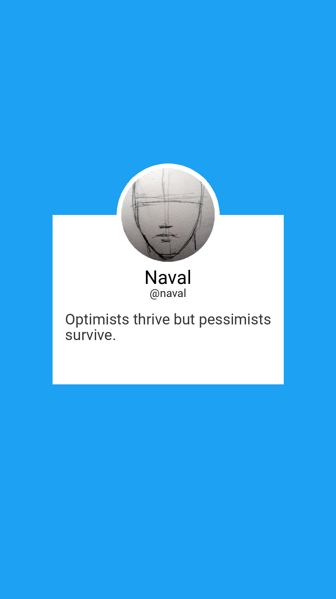

# Tweet2Story
Create instagram stories from tweets using cli.



## Requirements 
* [Pillow](https://pillow.readthedocs.io/en/stable/) 
* [Tweepy](https://www.tweepy.org/) 
* [Click](https://click.palletsprojects.com/en/7.x/) 
* [Twint](https://github.com/twintproject/twint)

## Commands

### Create a story using a url 
```
tweet2story -u <URL OF THE TWEET>
```

### Start a streamer (requires API keys to be exported)
```
tweet2story -s <username>
```

## Options 

Flag | Description
------------ | -------------
-u | Flag for url mode uses TWINT to generate the tweet no API integration required
-s | Flag for streamer mode REQUIRES API KEYS

## Roadmap
- [ ] Add media support in tweets
- [ ] Add thread support


## License 
MIT